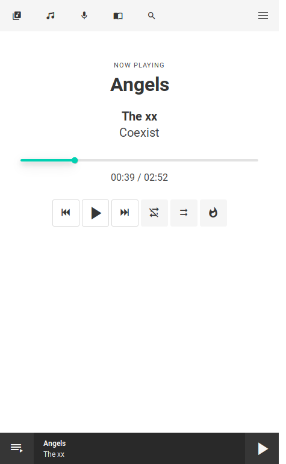
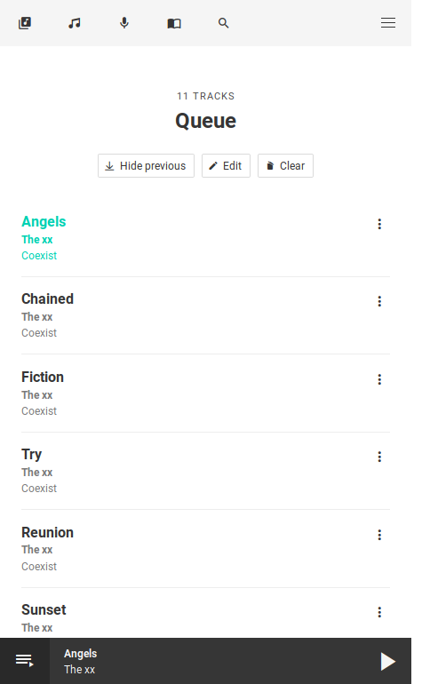
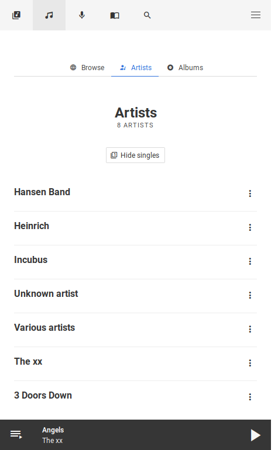
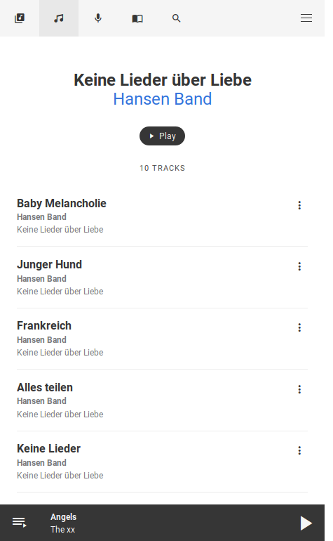

# forked-daapd-web

Mobile friendly web interface for [forked-daapd](http://ejurgensen.github.io/forked-daapd/) build with [Vue.js](https://vuejs.org), [Bulma](http://bulma.io).

## Screenshots






## Build Setup

This project is based on the Vue.js webpack template. For a detailed explanation on how things work, check out the [guide](http://vuejs-templates.github.io/webpack/) and [docs for vue-loader](http://vuejs.github.io/vue-loader).

``` bash
# install dependencies
npm install

# serve with hot reload at localhost:8080
npm run dev

# build for production with minification
npm run build

# build for production and view the bundle analyzer report
npm run build --report
```

After running `npm run dev` the web interface is reachable at [localhost:8080](http://localhost:8080). By default it expects **forked-daapd** to be running at [localhost:3689](http://localhost:3689) and proxies all JSON API calls to this location. If **forked-daapd** is running at a different location you need to modify the `proxyTable` configuration in `/config/index.js`